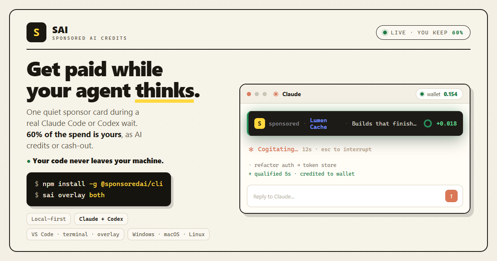
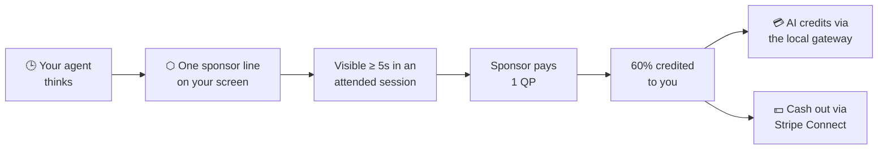

<div align="center">



### Get paid while your agent thinks.

**SAI** sells the quiet line your AI agent shows while it works — the
*"Percolating…"*, the *"Working in the app…"*, the spinner you stare at — and
pays **60% of the sponsor revenue back to you**, the developer whose machine
showed it. Take it as **AI credits or cash**.

[](https://sponsoredai.dev)
[](https://www.npmjs.com/package/@sponsoredai/cli)
[](https://marketplace.visualstudio.com/items?itemName=Sacud.sponsoredai-credits)
[](https://github.com/TheSacud/sponsoredai-public/actions/workflows/tests.yml)
[](LICENSE)

</div>

---

## 💡 The idea

Claude Code, Codex, and long-running agents spend a lot of time thinking. That
wait is dead air on your screen. SAI fills one line of it with a single, quiet,
**clickable** sponsor placement while you keep coding.

```diff
  · Refactoring the auth module… (12s · esc to interrupt)
+ ⬡ Sponsored · Linear — issue tracking that keeps up with you ↗
```

When the placement is actually on screen long enough to count, the sponsor pays,
and 60% of that lands in your balance. You watch it tick up:

```text
SAI  ·  $0.42 today  ·  $7.11 spendable  ·  credits or cash
```

No surveys, no tokens to buy, no video to sit through. You run your agent the way
you already do.

## 🚀 60-second start

```bash
npm install -g @sponsoredai/cli

sai claude            # or: sai codex
sai overlay both      # desktop overlay for Claude Desktop + Codex app
sai wallet            # check your balance
```

No sign-up first — SAI creates its local install state when it is needed. It
measures the *wait*, never the *work* (details in the next section). Turn the
volume down or off whenever you want:

```bash
sai config set frequency low
sai config set frequency off
sai config kill-switch on --reason "incident"
```

Prefer VS Code? Install **[SAI Credits](https://marketplace.visualstudio.com/items?itemName=Sacud.sponsoredai-credits)**
from the Marketplace for the sponsor view, wallet, and one-click agent launchers.

## 🔒 Your code never leaves your machine

This is the part most "earn while you code" ideas get wrong. SAI measures the
*wait*, not the *work*.

It does not upload prompts, source code, model responses, terminal logs, file
paths, repository URLs, shell history, screenshots, window titles, or window
contents. The terminal runner watches output *timing*. The desktop overlay
checks whether a supported window is visible and recently used before a
placement can qualify. Raw window state stays local.

What reaches the server is one allowlisted event:

```json
{
  "surface": "cli_agent_wait",
  "tool": "codex",
  "event": "agent_thinking",
  "duration_bucket": "10-30s",
  "terminal_interactive": true,
  "ci": false,
  "country": "PT",
  "code_uploaded": false,
  "prompt_uploaded": false,
  "logs_uploaded": false
}
```

Alongside it travel technical identifiers only (`install_id_hash`, `session_id`,
`placement_id`, `campaign_id`, `signature`, `cli_version`). Desktop overlay
events use the same shape with `surface: "desktop_overlay"`.

This repo is the real client. You can read exactly what runs, and you can print
the live schema yourself:

```bash
sai privacy schema
```

The full data-boundary contract lives in this repo as **[TRUST.md](TRUST.md)**,
with the hosted copy at **[sponsoredai.dev/trust](https://sponsoredai.dev/trust)** —
and `tests/` enforces it in CI.

## 💸 How the money works



- **Sponsors buy qualified placements.** The paid unit is fixed:
  `1 QP = 1 qualified five-second placement`.
- **Your share is 60%**, credited per qualified placement and per click.
- **Clicks pay more.** A click bills the sponsor a multiplier (default 50×) over
  the placement rate and pays you the same 60% net split.
- **Credits or cash.** Spend your balance on model calls through the local
  gateway, or cash out through Stripe Connect once you pass the threshold and
  review. It is your choice each time.

A placement only counts when the backend issued it, the campaign is live,
approved, and funded, the card rendered in an interactive terminal or attended
overlay (never CI or headless), it stayed visible for at least five seconds, the
event arrived before expiry and is not a duplicate, and it passes the fraud
filters. The contract is public and unauthenticated:

```bash
curl -fsS https://sponsoredai.dev/v1/metric-contract
```

## 🖥️ Where the sponsor line shows up

| Surface | Where | Needs |
| --- | --- | --- |
| **Terminal sponsor line** | Claude Code / Codex CLI wait | Any version |
| **Pinned spinner line** | Claude Code / Codex CLI on Windows | `pywinpty` (ConPTY) |
| **Desktop overlay** | Claude Desktop, Codex app | Windows x64 or macOS arm64 |
| **VS Code sponsor view** | Claude / Codex panels in VS Code | The SAI extension |

Sponsor cards appear for interactive terminals or attended desktop overlays over
supported apps. CI and headless runs are left alone, and the kill switch turns
everything off instantly.

## 📣 Want to sponsor?

You are reaching the most technical audience there is, in the calmest format
there is: one line, while they wait. Set a budget, drop in a creative, go live.

→ **[Buy inventory at sponsoredai.dev](https://sponsoredai.dev)**

## 🧱 What's in this repo

This is the **open-source SAI client** — the CLI, the local gateway, and the
desktop overlay that run on your machine. It is published in full so you can
audit it.

```text
src/sai/            the CLI, PTY runner, gateway, overlay, privacy schema
vscode-extension/   the VS Code surface (launchers, wallet, sponsor view)
npm/                the @sponsoredai/cli launcher + platform packages
site-v3/            the public marketing + trust pages
tests/              the suite that guards the trust boundary
TRUST.md            the public data-boundary contract
```

The hosted backend (sponsor server, billing, fraud, and payout engine) is a
separate proprietary service operated by SAI. The client only talks to it over
the documented public endpoints.

## 🛠️ Run and build from source

**CLI**

```bash
sai login
sai run -- npm test          # wrap any long command
sai overlay codex
sai logs tail --lines 120
sai dashboard                # local ledger at http://127.0.0.1:8787/
```

**Gateway.** `sai claude` and `sai codex` start it automatically; run it by hand
with `sai gateway serve --host 127.0.0.1 --port 8787`. Point an
OpenAI-compatible client at `http://127.0.0.1:8787/v1`. With no upstream it
returns a deterministic local mock; set a preset (`SAI_GATEWAY_PROVIDER`) plus
that provider's key to proxy a real one. Your earnings are spendable on model
calls without SAI ever seeing model traffic — the gateway requests a
per-installation provider key whose spend limit equals your spendable balance,
and calls go straight from your machine to the provider.

**Build and test**

```bash
python -m pip install -e ".[test]"
PYTHONPATH=src python -m sai --help
python -m pytest

# standalone binary (per-OS; PyInstaller does not cross-compile).
# onedir, not onefile: a onefile binary re-extracts its whole bundle to a temp
# dir on every invocation, adding seconds of startup to each `sai` command.
python -m PyInstaller --onedir --name sai --paths src \
  --exclude-module sai.backend --exclude-module sai.dev_mock \
  --collect-data certifi scripts/pyinstaller_entry.py
# Windows additionally needs `--collect-all winpty` for the ConPTY compositor.
```

CI in `.github/workflows/` runs the test suite on every push and builds the
Linux, macOS, and Windows binaries plus the npm launcher and platform packages
on tagged releases.

The POSIX runner uses a real PTY and tracks output timing, not content. On
Windows a ConPTY compositor pins the sponsor line via `pywinpty`; without it the
runner falls back to passthrough execution. The desktop overlay is tested on
Windows x64 and macOS arm64 with Claude Desktop and the Codex app; Linux is
supported for the terminal CLI only in this release.

Issues and pull requests are welcome — the privacy tests in `tests/` are the
contract, so changes that touch the trust boundary must keep them green.

## 📜 License

**AGPL-3.0-or-later** — see [`LICENSE`](LICENSE). Copyright © 2026 SAI.

The AGPL covers this client. Because SAI holds the copyright, it also operates a
proprietary hosted backend; the AGPL's network-use and copyleft terms bind
third-party redistributors, not the original author.

<div align="center">
<br>
<sub>Built by <a href="https://sponsoredai.dev">SAI</a> · your wait is real estate · 60% is yours.</sub>
</div>
